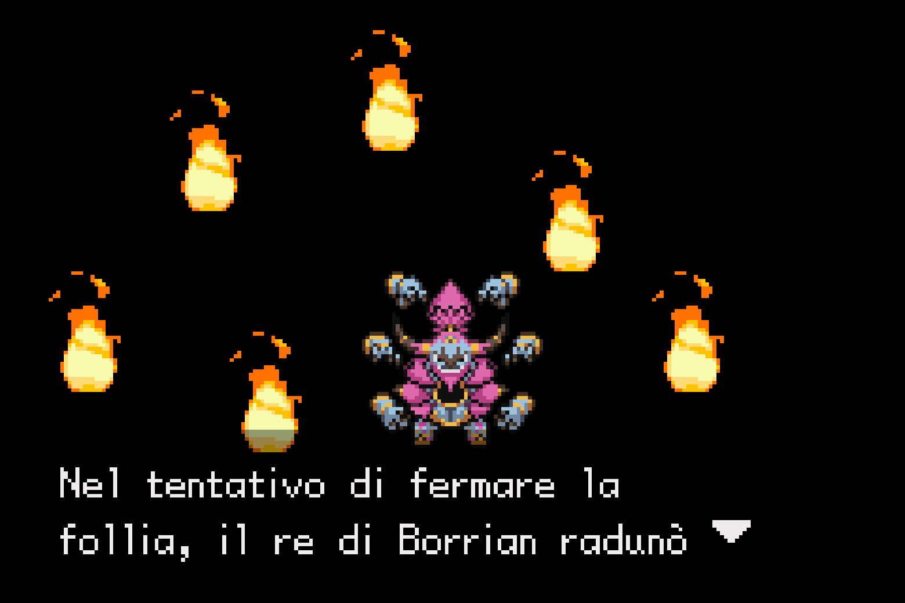

# unbound-translator

`unbound-translator` is a project aimed at translating the game Pokémon Unbound into other languages.

## Preview



The project was previously based on [Olcmyk/Meowth-GBA-Translator](https://github.com/Olcmyk/Meowth-GBA-Translator), but it quickly transitioned to custom scripts because of how that translator works. Meowth expands the ROM to 32 MB and writes all translated text into a dedicated area. That approach cannot work cleanly with Pokémon Unbound, because Unbound is already a 32 MB GBA ROM.

## How It Works

The current injector uses a hybrid strategy:

- Short translated strings that still fit their original slots are written in place.
- Longer pointer-based strings are relocated into free space inside the existing ROM.
- Free space is found by scanning for contiguous `0xFF` blocks.
- Script pointers are then updated to point at the relocated translated text.

This avoids expanding the ROM while still allowing longer translations where the original text was pointer-based.
By default, the injector only relocates pointer-based text when the encoded translation no longer fits its original slot. Use `--pointer-policy changed` only for experiments that intentionally relocate every changed pointer string.
Some common engine routine strings are marked with `no_relocation: true` during extraction. These entries must stay in their original slots because redirecting their pointers can freeze receive-item, Cube, PC, or field routines. Keep their translations short enough to fit their original `byte_length`; the injector will never relocate them and reports `No-reloc truncated` if any are too long.

## Free Space

This relocation approach was possible because Pokémon Unbound still has `1,102,003` bytes of free space available in the ROM. Those regions are detected by scanning for contiguous `0xFF` blocks and are used as targets for translated strings that no longer fit in their original locations.

## Workflow

Put the source ROM somewhere in the repo, for example:

```bash
rom/unbound.gba
```

The ROM used for this project has MD5:

```text
9cad8e771940e7f7094d13911552cef0
```

### 1. Extract Text

```bash
./001_extract_unbound_text.py rom/unbound.gba -o out/unbound-texts.json
```

This step extracts text as-is from the ROM. It should stay lossless and should not try to reshape dialogue layout.

The extractor intentionally reads 255 ability descriptions even though the ROM has 293 ability names. The words after ability-description index 254 are not text pointers and decode as garbage, so they are skipped.

Opening narration and other full-screen script text is extracted into the `plain_scripts` category. These entries still use `scr_` ids, but they are kept separate from normal dialogue scripts so later layout repair can use plain full-screen line breaks instead of dialogue continuation controls.

Manual entries are extracted for common UI, Cube V3, save, game settings, PC, party, item storage, link control, battle, trainer-card, multiplayer, standalone label, options, item descriptions, battle messages, Pokemon summary text, and mission log/objective text. The extractor uses explicit addresses plus narrow vetted PCS ranges for contiguous text blocks, including mission-log menu filters/status labels at `0x1F56040-0x1F56117`, battle-setting labels at `0x1F94185-0x1F94480`, and the newer Trainer Card profile labels and month names at `0x1F81E44-0x1F81EE5`. It also accepts direct high-bank text pointers from `0x1E70000-0x1EB6000` to targets in `0x1F00000-0x1FB0000`, covering many mission names, descriptions, objectives, and late NPC lines that do not use normal script loadpointer opcodes. When the ROM contains exact GBA pointers to those manual strings, it records those pointer sources so the hybrid injector can relocate longer translations.

To audit menu coverage during extraction, search the ROM for PCS-encoded UI strings and compare the hits against the extracted entries:

```bash
./001_extract_unbound_text.py rom/unbound.gba -o out/unbound-texts.json --audit-menu-text
```

This is an optional extraction check, not a separate workflow stage. It reports `found_and_extracted`, `found_but_not_extracted`, and `not_found_as_pcs_text`. A not-found result may be graphical/tile text, compressed data, or a custom UI encoding. Use `--audit-output out/menu-audit.json` when a machine-readable report is useful.

### 2. Prepare Translation Text

```bash
./002_prepare_translation_text.py out/unbound-texts.json -o out/unbound-texts-prepared.json
```

This adds a `translation_source` field to each entry. The `original` field stays untouched, while `translation_source` removes layout markers such as actual line breaks, `\n`, `\l`, `\p`, and `\pn`.

Semantic/control tokens are preserved in `original` because the game engine needs them. In `translation_source`, they are replaced with readable placeholders such as `[player-name-1]`, `[buffer1-2]`, `[color-red-3]`, `[button-icon-4]`, or `[control-code-5]`. The matching real tokens are stored in `semantic_token_placeholders` so the translator can restore them after the LLM responds. Examples of real tokens include variables like `[player]`, buffer placeholders like `[buffer1]`, color tags like `[red]`, byte/control escapes like `\CC12`, button icons like `\btn01`, Pokémon glyph tokens like `\pk` and `\mn`, quote tokens like `\qo` and `\qc`, and raw byte placeholders like `{B4}`.

### 3. Translate Text

```bash
./003_llm_translate.py out/unbound-texts-prepared.json \
  --target it \
  --api-base https://opencode.ai/zen/go/v1 \
  --api-key YOUR_API_KEY \
  --model your-model-name \
  --workers 4 \
  --batch-size 20 \
  -o out/unbound-texts-it.json
```

If the translation is interrupted, resume from the existing output JSON:

```bash
./003_llm_translate.py out/unbound-texts-prepared.json \
  --target it \
  --api-base https://opencode.ai/zen/go/v1 \
  --api-key YOUR_API_KEY \
  --model your-model-name \
  --workers 4 \
  --batch-size 20 \
  -o out/unbound-texts-it.json \
  --resume
```

The script defaults to an OpenAI-compatible chat completions API. It validates every returned batch. If a batch reaches the API output token limit, the script falls back to translating each entry individually; if a single-entry request still reaches the limit, it retries that entry with a compact single-item prompt and then a plain-text prompt using the same model. If the entry still cannot be translated because of the output token limit, the script prints a warning with the entry id, leaves that entry untranslated, and continues.

The translator uses `translation_source` when present. It asks the model to preserve the readable placeholders, replaces those placeholders with the original semantic/control tokens after each response, then checks that every protected token from the English source is present with the same count and that no extra protected tokens or layout markers were added. If the check fails, it prints a warning and retries the translation.

If the script has to fall back to a single-entry prompt, it prints a warning with the affected entry id. These cases use less context than the normal batch prompt and may produce less accurate translations, so they are worth reviewing and keeping as rare as possible.

For debugging, `--exclude-categories` removes whole categories from the translated output JSON before translation. Excluded categories are not copied as English entries. `--include-ids`, `--include-id-ranges`, `--include-categories`, and `--include-category-prefixes` keep only a manual whitelist. `--priority-order` sorts missing entries so common UI/menu/short/high-value text is translated first, and `--limit N` translates only the first `N` missing entries after filtering and sorting.

To use a ChatGPT subscription login instead of an API key, install and log in with the Codex CLI first (`codex login`), or provide `CODEX_ACCESS_TOKEN`. Then run the translator with `--auth chatgpt`; this delegates model calls to `codex exec` and reuses Codex's saved ChatGPT credentials:

```bash
./003_llm_translate.py out/unbound-texts-prepared.json \
  --target it \
  --auth chatgpt \
  --model gpt-5.4 \
  --workers 1 \
  --batch-size 10 \
  -o out/unbound-texts-it.json
```

Translation progress is shown as a fixed `0` to `100%` progress bar based on the total translatable entries in the file, so resumed runs continue from the already completed percentage. When `--rate-limit` makes the script wait before the next API call, the progress bar temporarily shows a shared `waiting for rate limit reset` countdown and clears it once the wait is over.

Transient API failures such as empty responses, non-JSON HTTP responses, invalid model JSON, missing choices, semantic/control-token mismatches, and server/network errors are retried up to 3 total attempts. Unauthorized requests, forbidden requests, rate-limit responses, other 4xx client errors, and partial or mismatched batch responses stop immediately.

For slow or free-tier APIs, use `--rate-limit` to cap total API calls per minute across all workers:

```bash
./003_llm_translate.py out/unbound-texts-prepared.json \
  --target it \
  --api-base https://opencode.ai/zen/go/v1 \
  --api-key YOUR_API_KEY \
  --model your-model-name \
  --workers 4 \
  --batch-size 20 \
  --rate-limit 30 \
  -o out/unbound-texts-it.json \
  --resume
```

For OpenCode, use `--api-base https://opencode.ai/zen/go/v1`; the script appends `/chat/completions` automatically. If the provider returns `API HTTP 403: error code: 1010`, the request is being rejected by the upstream gateway before reaching the model. The script sends a browser-like `User-Agent` by default, and it can be overridden with `--user-agent`.

For now, only Latin-script target languages are supported by the translation script because non-Latin languages will likely require a font patch. The prompt asks the model to use established official Pokémon terminology for moves, items, abilities, descriptions, and common franchise text. If the selected API/model has web or retrieval access, it is instructed to consult reputable Pokémon references such as Bulbapedia or Pokémon Database; plain OpenAI-compatible chat APIs usually do not browse the web by themselves.

### Debug Build

This launches the full workflow on a manually whitelisted translation set. It is useful for quickly testing specific dialogue ranges and all extracted menu text without spending time translating the whole ROM.

```bash
./001_extract_unbound_text.py rom/unbound.gba -o out/debug-unbound-texts.json
./002_prepare_translation_text.py out/debug-unbound-texts.json -o out/debug-unbound-texts-prepared.json
./003_llm_translate.py out/debug-unbound-texts-prepared.json \
  --target it \
  --api-base https://opencode.ai/zen/go/v1 \
  --api-key YOUR_API_KEY \
  --model your-model-name \
  --workers 4 \
  --batch-size 20 \
  --include-ids scr_07448,scr_05226,scr_05227,scr_07449 \
  --include-id-ranges scr_09019-scr_09114 \
  --include-category-prefixes menu_ \
  -o out/debug-unbound-texts-it.json \
  --overwrite
./004_controlfix_translations.py out/debug-unbound-texts-it.json \
  -o out/debug-unbound-texts-it-controlfix.json \
  --source out/debug-unbound-texts-prepared.json \
  --report out/debug-controlfix-report.json
./005_hybrid_injector.py rom/unbound.gba out/debug-unbound-texts-it-controlfix.json \
  -o out/debug-unbound-translated.gba \
  --map-output out/debug-hybrid-map.json
```

All entries outside the whitelist are omitted from `out/debug-unbound-texts-it.json`, which keeps the debug JSON smaller and easier to inspect.

### Codex Project Agents

Project-scoped Codex settings live in `.codex/config.toml`, custom subagents live in `.codex/agents/`, and reusable repo skills live in `.agents/skills/`. They cover extraction coverage, debug builds, translation runs, controlfix/layout repair, injector QA, docs sync, and bounded parallel review.

### 4. Repair Control Codes And Layout

Run the control-fix script after translation:

```bash
./004_controlfix_translations.py out/unbound-texts-it.json \
  -o out/unbound-texts-it-controlfix.json \
  --source out/unbound-texts-prepared.json \
  --report out/controlfix-report.json
```

This step is still needed. It repairs common translation damage such as broken control codes, misplaced braces, outer quotes, and apostrophes. It also recomputes layout after translation: dialogue-like text is wrapped into pages using line breaks and `\l`, while `plain_scripts`, descriptions, mission objectives, Pokémon summary text, and battle messages are wrapped with regular line breaks. Item descriptions use a wider 3-line layout by default. Compact multi-row menu labels keep their original row breaks, which is required for selectable choices such as `Yes\nNo`.

### 5. Inject Translation

```bash
./005_hybrid_injector.py rom/unbound.gba out/unbound-texts-it-controlfix.json \
  -o out/unbound-translated.gba \
  --map-output out/hybrid-map.json
```

The output ROM will be written to:

```bash
out/unbound-translated.gba
```

For `plain_scripts`, the injector preserves full-screen blank lines as repeated newline bytes (`0xFE 0xFE`) instead of the paragraph/prompt byte (`0xFB`). This avoids the bottom-arrow prompt behavior used by normal dialogue boxes.

## Ready Translations

In the `ready-translations` folder you can find pre-translated text in both JSON and BPS patch format. For now, only Italian is included.

The ready translations currently included in the repo were made using DeepSeek V4 Flash.

## Known Issues

This repo is in a very early stage, so bugs can occur. Some text may glitch out of the screen, or the screen may flash red or other colors in some places.

The scripts have been tested with the Italian language. Support for other languages can be added, for example German.

## TODO

- Add pre-made translations for other languages
- Polishing

## Notes

- The injector does not expand the ROM.
- Pointer-based text may be relocated into existing `0xFF` free space.
- Fixed-size text and `no_relocation` pointer text may still need shorter translations.
- `hybrid-map.json` records relocation decisions and injection stats.
- Issues and pull requests are welcome.
- Yes, this repo is vibecoded, I'm sorry but I don't have time to manually work on this...
